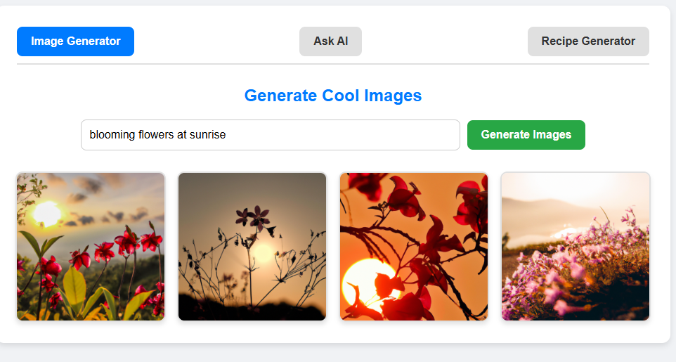
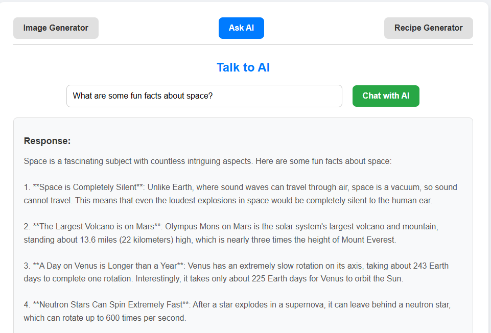
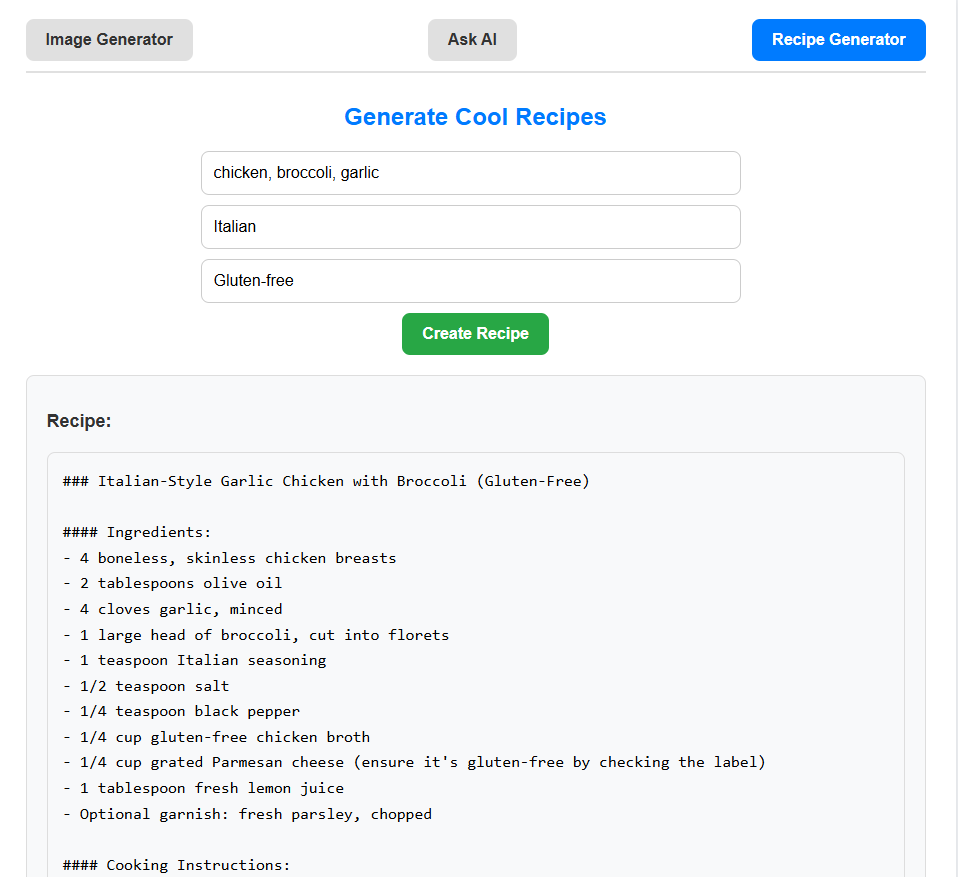

# Spring AI Utility Suite: Image Generation, Chat, and Recipe Creator

An AI-powered web application with multiple functionalities utilizing OpenAI API.

---

### 🚀 Tech Stack
- **Frontend**: JavaScript, React, CSS
- **Backend**: Java Spring Boot, Spring AI Starter, Maven
- **API**: OpenAI API

---

### ✨ Features
1. **Image Generator**:
   - Generate stunning images by providing a text-based prompt.
2. **Chat with AI**:
   - Ask questions and get AI-generated responses in real-time.
3. **Recipe Creator**:
   - Create unique recipes by specifying ingredients, cuisines, and dietary restrictions.

---

### 🖥️ Screenshots

---

